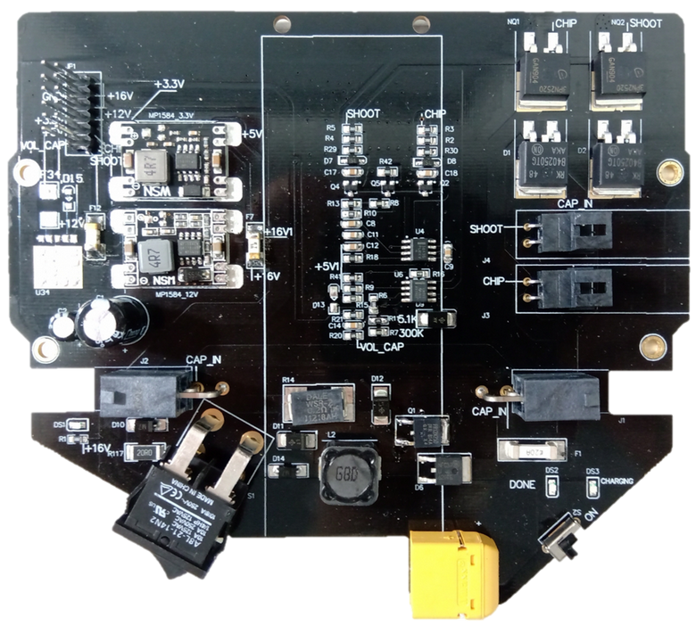
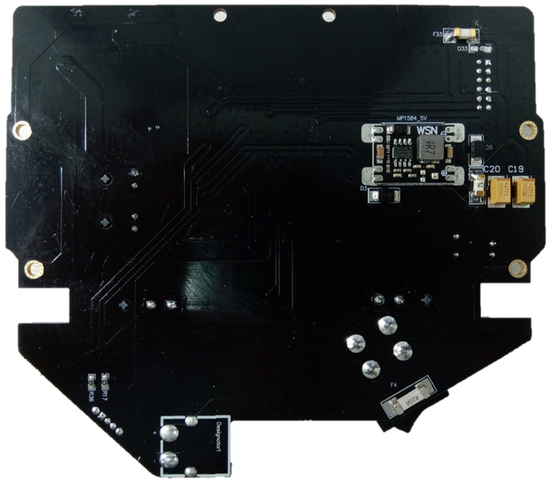
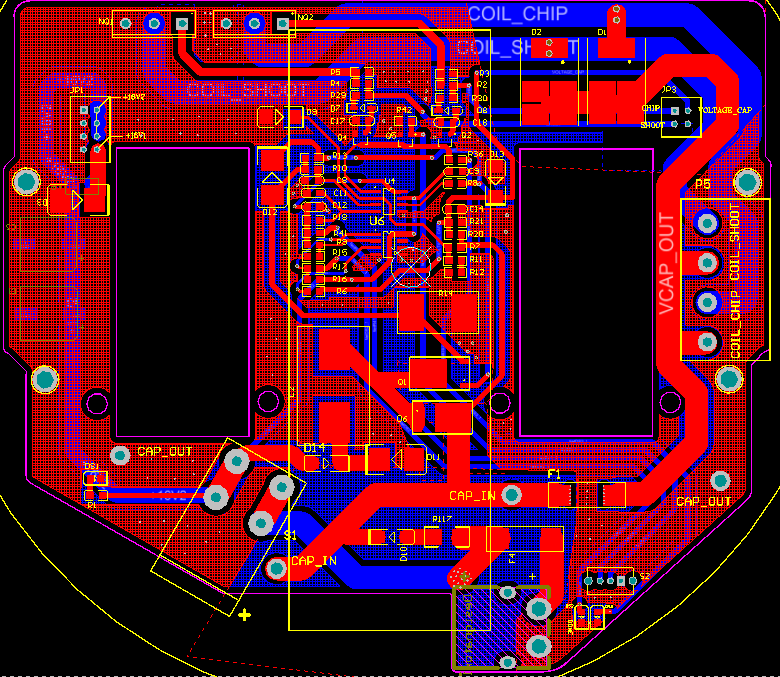
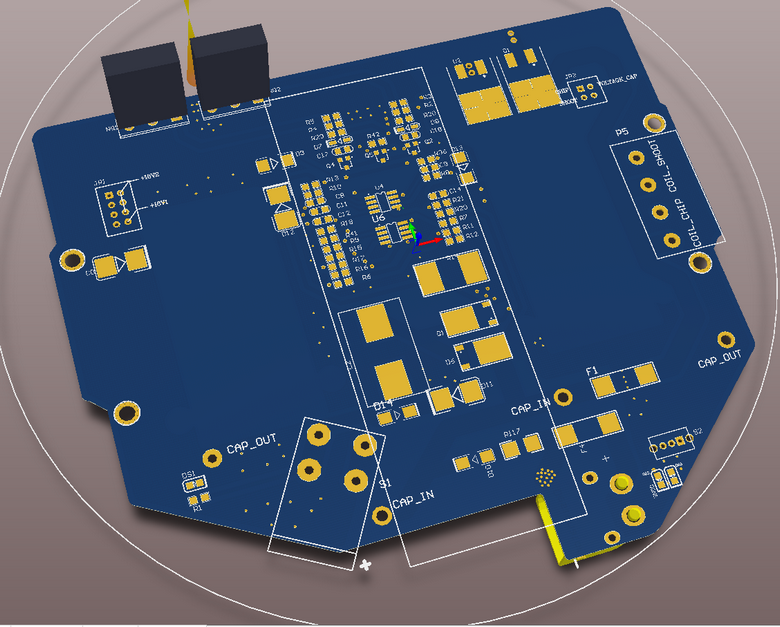
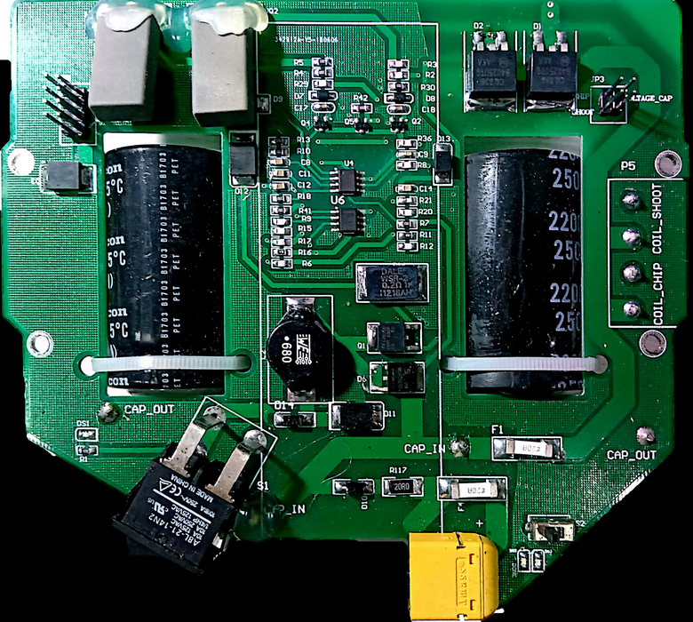
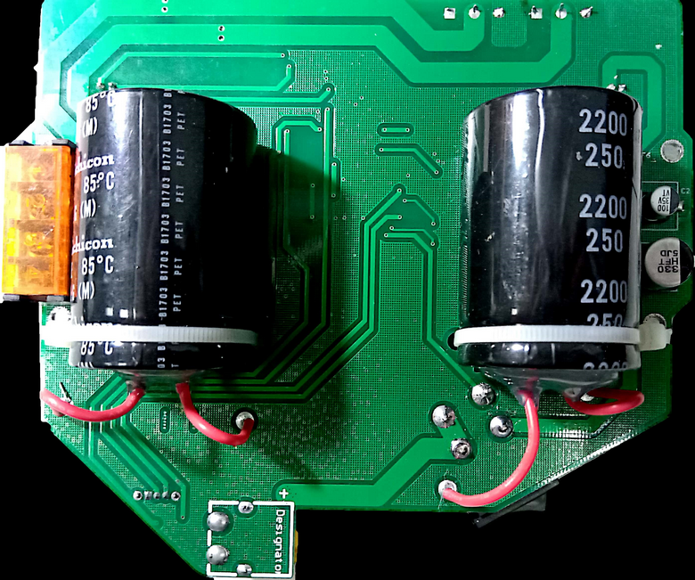

# ZJUNlict Booster Board Description

RoboCup 2019 Competition Version

Modifications are made to the design of the [booster board 2018 RoboCup Version](https://github.com/ZJUNlict/Booster_Board/releases). 

The major modifications are:

* Use Molex Connectors for capacitors and coils for easier assembly and maintenance.
* Add three MP1584EN (12V, 5V, 3.3V) modules for DC-DC conversion.
* Change the MOSFETs to IPB64N25S3-20 or IPB200N25N3GATMA1 with D2PAK package.

The photos of booster board 2019 version are shown below. 

--------------------------

RoboCup 2018 Competition Version

The booster board is used to charge capacitors and discharge via shoot and chip coils. The 2D and 3D design views are shown below. (The board is designed using [Altium Designer](https://www.altium.com/altium-designer/) 17.1)

The main features are:

* Current-mode PWM controller UC3843 acts as a booster converter to charge two capacitors (each with 2200 uF capacitance and voltage rating at 250V) to 225V (Adjustable by simply modifying the voltage feedback resistor pair).
* Two MOSFETs (IPP200N25N) control the discharge duration of the cpacitors.
* A voltage comparator is used to show if the capacitors are charged through an LED to avoid accidental electric shock.
* Limiting voltage and current to the main borad.

The photos of the booster board are shown below as references. 

